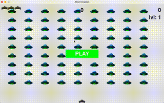

# Alien Invasion - Space Shooter Game

Welcome to the Alien Invasion Space Shooter game! This project is inspired by
the book "Python Crash Course" by Eric Matthes and is built using Python and
Pygame. In this game, you control a spaceship at the bottom of the screen,
shooting at waves of aliens moving from side to side and gradually descending
toward you.



## Features

- **Space Shooter Mechanics**: Control a spaceship to shoot at advancing
  aliens.
- **Wave System**: Aliens come in waves, each wave harder than the last.
- **Lives System**: The player has 3 ships (lives) by default. Lose a ship if
  an alien reaches the bottom or collides with the spaceship.  
- **Basic Graphics and Sound**: Use Pygame to create a visually engaging game
  experience.

## Getting Started

To get the game up and running on your local machine, follow these steps:

### Prerequisites

- Python 3.x installed on your system.
- Pygame.

## Setup

1. **Clone the Repository**

Clone this repository to your local machine using Git:

```sh
git clone https://github.com/yourusername/alien-invasion.git
cd alien-invasion
```

2. **Create a Virtual Environment**

Create a virtual environment to manage dependencies:

```sh
python3 -m venv venv
```

3. **Activate the Virtual Environment**

```sh
source venv/bin/activate
```

4. **Install Dependencies**

Install the required dependencies listed in `requirements.txt`:

```sh
python -m pip install -r requirements.txt
```

5. **Running the Game**

Run the game by executing the main.py file:

```sh
python alien_invasion.py
```

## Game Controls

- Left Arrow Key (←): Move the spaceship left.
- Right Arrow Key (→): Move the spaceship right.
- Spacebar: Fire bullets.

## How to Play

- **Objective**: Shoot down all the aliens before they reach the bottom of the
  screen or collide with your spaceship.
- **Spaceship Movement**: Use the left and right arrow keys to move the
  spaceship horizontally at the bottom of the screen.
- **Shooting**: Press the spacebar to fire bullets at the aliens.
- **Lives**: You have 3 ships (lives). You lose a ship if an alien reaches the
  bottom of the screen or collides with your spaceship.
- **Winning**: Clear all waves of aliens to win the game.
- **Losing**: Lose all your ships, and it's game over.

Feel free to fork the repository, make changes, and submit pull requests. For major changes, please open an issue first to discuss what you would like to change.

## Acknowledgments

- Inspired by "Python Crash Course" by Eric Matthes.
- Pygame documentation and community for their invaluable resources.

Enjoy defending your spaceship from the alien invasion! Happy coding! 🚀👾
